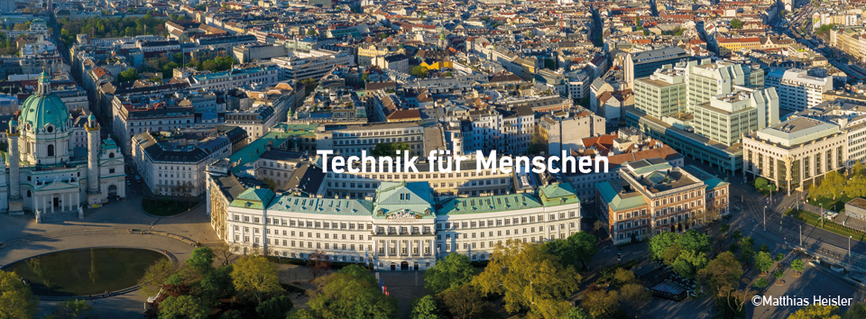

# University Assistant (PostDoc)

Full-time (40 hours/week) | for about one year | part-time possible

With over 26,000 students and 4,000 scientists, **TU Wien** is Austria’s largest institution of research and higher education in the fields of technology and natural sciences. For more than 200 years research, teaching, and learning at TU Wien have been guided by the motto "Technology for People" and dedicated to the advancement of science and technology. The computer science faculty of TU Wien consistently ranks among the top 100 departments in the world. 

The [research unit **Machine Learning**](https://www.ml.tuwien.ac.at/) **has now an opening for a university assistant** (post-doc: 40 hours/week for one year; part-time possible; earliest starting data is May 2022) in the FFG Project [AI4SAR](https://projekte.ffg.at/projekt/4052506). The aim of the project is to investigate, develop, and apply unsupervised, active, and knowledge-based machine learning algorithms for advanced processing of Synthetic Aperture Radar (SAR) data. 
### Your Tasks: 

- Research in machine learning and publication of results in top scientific venues 
- Collaboration and coordination of activities in the FFG project AI4SAR 
- Participating and presenting in scientific and project meeting 
- Support of teaching activities: preparation of teaching materials, (co-)supervision of seminars, exercises, internships, bachelor’s and master’s theses 
- Assistance with administrative tasks 

### Your Profile: 

- PhD in Machine Learning, Computer Vision, Remote Sensing, or related areas 
- Proven track record of publications in top scientific venues of your field 
- Programming experience and strong background in the mathematical foundations of machine learning 
- Strong interest in machine learning theory and algorithms with a willingness to apply the algorithms to real data 
- Curious and highly motivated for scientific research 
- Ability to work independently as well as in a team 
- Very good spoken and written English. Knowledge of German (language level B2) or willingness to learn it in the first year 

### We Offer: 

- Opportunity to further develop your research career and scientific potential 
- Dynamic and constantly evolving work environment 
- Wide range of continuing education and flexible working hours 
- Possibility to participate in structured doctoral programmes 
- Central location of workplace with very good accessibility (U1/U2/U4 Karlsplatz) 
- A creative environment in one of the most liveable cities in the world 
- Additional benefits for employees can be found at the following link: [Fringe-Benefit Catalogue of TU Wien](https://url.tuwien.at/cfjyv)
 

 

TU Wien is committed to increasing the proportion of women in particular in leadership positions. Female applicants are explicitly encouraged to apply. Preference will be given to women when equally qualified, unless reasons specific to a male applicant tilt the balance in his favour.  

People with special needs are equally encouraged to apply. In case of any questions, please contact the confidant for disabled persons at the university, Mr. Gerhard Neustätter.  

Entry level salary is determined by the pay grade B1 of the Austrian collective agreement for university staff. This is a minimum of currently EUR 4,061.50/month gross, 14 times/year for 40 hours/week. Relevant working experiences may increase the monthly income. Part-time arrangements are possible. 

**We look forward to receiving your application by 31/03/2022 via <applications@ml.tuwien.ac.at> where you can also contact us if you have any questions about the position.**
